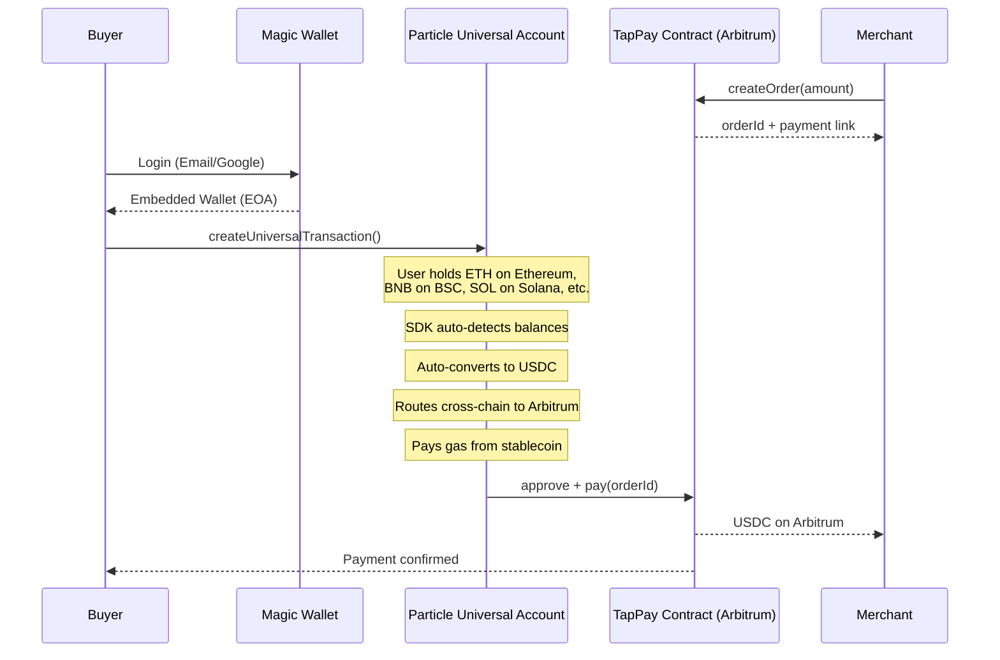

# TapPay — Tap. Pay. Any Chain.

> **One tap to pay with crypto. No wallet app. No chain switching. No friction.**

TapPay brings tap-to-pay simplicity to crypto payments. Merchants create orders with a tap, customers pay with any stablecoin on any chain — no wallet installation, no ETH for gas, no network switching. Just tap your phone and pay.

[](https://particle.network)
[](https://eips.ethereum.org/EIPS/eip-7702)
[](https://arbitrum.io)
[](https://magic.link)

---

## Why TapPay?

**The problem:** Crypto payments are broken for real-world use. Users need wallets, gas tokens, chain awareness — friction that kills adoption.

**The solution:** TapPay makes crypto payments feel like Apple Pay. One tap, done. The complexity of cross-chain operations, gas abstraction, and wallet management stays invisible.

**Pay with anything:** Buyers can pay with any token on any supported chain — ETH on Ethereum, BNB on BSC, etc. The Universal Account SDK automatically converts and routes everything to USDC on Arbitrum for the merchant. Users don't need to know what chain they're on.

**Supported chains:** Ethereum, BNB Chain (BSC), X Layer, Base, Arbitrum, Solana. ([View official list →](https://developers.particle.network/universal-accounts/chains))

<div style="display: flex; gap: 10px; justify-content: center;">
  
  
  
  
</div>

---

## How It Works

### For Merchants

1. **Login** — Sign in with email or Google (no wallet needed)
2. **Create Order** — Enter amount in USDC, get a payment link
3. **Share** — Display QR code, copy link, or write to NFC tag
4. **Get Paid** — Funds arrive directly in your account on Arbitrum

### For Buyers

1. **Tap or Scan** — Tap NFC tag or open payment link
2. **Login** — Sign in with email or Google (first time only)
3. **Pay** — Confirm payment with any token on any supported chain (ETH on Ethereum, BNB on BSC, SOL on Solana, etc.)
4. **Done** — Particle UA automatically converts and routes funds; merchant receives USDC on Arbitrum

**The magic:** Buyers don't need to hold USDC or know about Arbitrum. The Universal Account SDK handles cross-chain routing and token conversion behind the scenes.

**Supported chains:** Ethereum, BNB Chain (BSC), X Layer, Base, Arbitrum, Solana. ([View official list →](https://developers.particle.network/universal-accounts/chains))

---

## Architecture



---

## Tech Stack

| Layer | Technology | Purpose |
|-------|------------|---------|
| **Smart Contract** | Solidity + OpenZeppelin | TapPay payment protocol on Arbitrum |
| **Chain Abstraction** | Particle Universal Accounts SDK | Cross-chain transactions, unified balance |
| **Embedded Wallet** | Magic SDK | Email/Google social login, EIP-7702 signing |
| **Frontend** | Next.js 13 + TypeScript + Tailwind CSS | Responsive web app |
| **Blockchain** | Arbitrum One | Low-cost, high-speed settlement layer |

---

## Particle Universal Accounts + EIP-7702

TapPay uses Particle Network's Universal Accounts SDK in **EIP-7702 mode** — the recommended approach for chain abstraction.

### What is EIP-7702?

EIP-7702 allows any existing EOA (Externally Owned Account) to be upgraded in-place to a smart account. No new address, no asset migration. The user's existing wallet becomes chain-abstracted instantly.

### Key Integration Points

```typescript
// Initialize Universal Account with EIP-7702 mode
const ua = new UniversalAccount({
  projectId: process.env.NEXT_PUBLIC_PROJECT_ID!,
  projectClientKey: process.env.NEXT_PUBLIC_CLIENT_KEY!,
  projectAppUuid: process.env.NEXT_PUBLIC_APP_ID!,
  smartAccountOptions: {
    useEIP7702: true,  // Enable EIP-7702 mode
    name: 'UNIVERSAL',
    version: UNIVERSAL_ACCOUNT_VERSION,
    ownerAddress: userAddress,
  },
  tradeConfig: {
    slippageBps: 100,
    universalGas: true,  // Pay gas from stablecoin
  },
});
```

```typescript
// Create cross-chain transaction
const tx = await ua.createUniversalTransaction({
  chainId: CHAIN_ID.ARBITRUM_MAINNET_ONE,
  expectTokens: [
    { type: SUPPORTED_TOKEN_TYPE.USDC, amount: '10.00' }
  ],
  transactions: [
    { to: USDC_ADDRESS, data: encodeApprove(spender, amount) },
    { to: TAPAY_ADDRESS, data: encodePay(orderId) },
  ],
});
```

### EIP-7702 Authorization Flow

```typescript
// Sign EIP-7702 authorization with Magic wallet
const authorization = await magic.wallet.sign7702Authorization({
  contractAddress: uaContractAddress,
  chainId: ARB_CHAIN_ID,
  nonce: authNonce + 1,
});

// Send Type-4 transaction for delegation
await magic.wallet.send7702Transaction({
  to: userAddress,
  data: '0x',
  authorizationList: [authorization],
});
```

**Why this matters:**
- **No new address** — User's existing EOA becomes the Universal Account
- **No asset migration** — Funds stay where they are
- **No wallet switching** — Works with embedded wallets (Magic, Privy, Dynamic)
- **Cross-chain magic** — User pays with USDC on Base/BSC/Solana, merchant receives on Arbitrum

[Particle Developer Docs →](https://developers.particle.network/universal-accounts/cha/overview)

---

## Magic Embedded Wallet

TapPay uses [Magic Labs](https://magic.link) for frictionless onboarding — no wallet installation required.

### User Experience

- **Email Login** — Enter email, receive OTP, done
- **Google Login** — One-click OAuth, instant access
- **Invisible Wallet** — Magic creates and manages the wallet behind the scenes

### Technical Integration

```typescript
// Initialize Magic with OAuth support
const magic = new Magic(process.env.NEXT_PUBLIC_MAGIC_API_KEY!, {
  network: { chainId: 42161, rpcUrl: 'https://arb1.arbitrum.io/rpc' },
  extensions: [new OAuthExtension()],
});

// Email login
const idToken = await magic.auth.loginWithEmailOTP({ email });

// Google OAuth
await magic.oauth2.loginWithRedirect({
  provider: 'google',
  redirectURI: window.location.origin + '/login',
});

// EIP-7702 signing (critical for Universal Accounts)
const auth = await magic.wallet.sign7702Authorization({
  contractAddress, chainId, nonce
});
```

**Why Magic?**
- **Zero friction** — Users never see a wallet address or seed phrase
- **EIP-7702 native** — Built-in support for `sign7702Authorization`
- **Consumer-ready** — Feels like a Web2 login, powers Web3 transactions

[Magic Documentation →](https://magic.link/docs)

---

## Arbitrum Integration

TapPay runs primarily on [Arbitrum](https://arbitrum.io) — the settlement layer where all payments finalize.

### Why Arbitrum?

- **Low cost** — Transactions cost cents, not dollars
- **Fast finality** — Payments settle in ~2 seconds
- **Ecosystem fit** — Arbitrum's vision of invisible blockchain aligns with TapPay's UX goals
- **EIP-7702 support** — Full compatibility with Particle's chain abstraction

### Consumer App Focus

Arbitrum powers the experience behind the scenes, but the user never has to think about:
- ❌ Which chain they're on
- ❌ How much gas to set
- ❌ Bridge mechanics
- ❌ Wallet addresses

They just tap and pay. Arbitrum handles the rest.

### Arbitrum as Settlement Layer

TapPay uses Arbitrum as the backend settlement layer:
- **Buyer perspective** — Pay with any token on any supported chain (ETH on Ethereum, BNB on BSC, SOL on Solana, etc.)
- **Merchant perspective** — Receive USDC on Arbitrum, always
- **Behind the scenes** — Particle UA handles cross-chain routing and token conversion

**Supported chains:** Ethereum, BNB Chain (BSC), X Layer, Base, Arbitrum, Solana. ([View official list →](https://developers.particle.network/universal-accounts/chains))

This is the power of chain abstraction: users see simplicity, Arbitrum provides the infrastructure.

[Arbitrum Developer Docs →](https://docs.arbitrum.io)

---

## Smart Contract

The `TapPay.sol` contract is deployed on Arbitrum One:

**Contract Address:** `0x9c043b4044386b8ccdab46870cacb86552baa579`

[View on Arbiscan →](https://arbiscan.io/address/0x9c043b4044386b8ccdab46870cacb86552baa579)

### Contract Features

```solidity
contract TapPay {
    // Create order (merchant only)
    function createOrder(uint256 amount) external returns (uint256 orderId);
    
    // Pay order (buyer)
    function pay(uint256 orderId) external;
    
    // Cancel order (merchant only, within 5 min)
    function cancelOrder(uint256 orderId) external;
    
    // Order expires after 5 minutes
    uint64 public constant ORDER_LIFESPAN = 5 minutes;
}
```

### Design Decisions

- **5-minute expiration** — Prevents stale orders, forces quick checkout
- **USDC only** — Stable value, no volatility risk
- **Merchant cancellation** — Allows merchants to cancel unpaid orders
- **Event-driven** — All state changes emit events for easy indexing

---

## Quick Start

### Prerequisites

- Node.js 18+
- npm or yarn
- Particle Network [API keys](https://dashboard.particle.network)
- Magic Labs [API key](https://dashboard.magic.link)

### Installation

```bash
# Clone the repository
git clone https://github.com/yourusername/tappay.git
cd tappay/app

# Install dependencies
npm install

# Start development server
npm run dev
```

Open [http://localhost:3000](http://localhost:3000) in your browser.

### Environment Variables

Create `.env.local` in the `app/` directory:

```env
# Particle Network (Required)
NEXT_PUBLIC_PROJECT_ID=your_particle_project_id
NEXT_PUBLIC_CLIENT_KEY=your_particle_client_key
NEXT_PUBLIC_APP_ID=your_particle_app_id

# Magic Labs (Required)
NEXT_PUBLIC_MAGIC_API_KEY=your_magic_api_key

# Arbitrum (Optional - defaults provided)
NEXT_PUBLIC_ARB_RPC_URL=https://arb1.arbitrum.io/rpc
NEXT_PUBLIC_ARB_USDC=0xaf88d065e77c8cC2239327C5EDb3A432268e5831
NEXT_PUBLIC_TAPAY_CONTRACT=0x9c043b4044386b8ccdab46870cacb86552baa579

# Etherscan (Optional - for contract verification)
ETHERSCAN_API_KEY=your_etherscan_api_key
```

### Getting API Keys

1. **Particle Network**
   - Go to [dashboard.particle.network](https://dashboard.particle.network)
   - Create a new project
   - Copy Project ID, Client Key, and App UUID

2. **Magic Labs**
   - Go to [dashboard.magic.link](https://dashboard.magic.link)
   - Create a new app
   - Copy the Publishable API Key

---

## Project Structure

```
app/
├── contracts/
│   └── TapPay.sol              # Smart contract
├── public/
│   └── ...                     # Static assets
├── src/
│   ├── components/
│   │   ├── landing/            # Landing page sections
│   │   ├── AccountPage.tsx     # User account & balance
│   │   ├── HistoryPage.tsx     # Transaction history
│   │   ├── LoginPage.tsx       # Auth (email/Google)
│   │   ├── MerchantDashboard.tsx  # Merchant order management
│   │   ├── PayPage.tsx         # Payment checkout
│   │   └── WithdrawModal.tsx   # Withdrawal flow
│   ├── hooks/
│   │   ├── useAuth.ts          # Authentication logic
│   │   ├── MagicProvider.tsx   # Magic SDK context
│   │   └── UniversalAccountProvider.tsx  # UA SDK context
│   ├── pages/
│   │   ├── index.tsx           # Landing page
│   │   ├── login.tsx           # Login page
│   │   ├── merchant.tsx        # Merchant dashboard
│   │   ├── pay.tsx             # Payment page
│   │   ├── account.tsx         # Account page
│   │   └── history.tsx         # History page
│   └── utils/
│       └── contracts.ts        # Contract interactions
├── package.json
└── README.md
```

---

## NFC Tap-to-Pay

TapPay's killer feature: **physical tap-to-pay using NFC tags**.

### How It Works

1. Merchant creates an order
2. Merchant writes payment URL to NFC tag (Android Chrome)
3. Customer taps their phone on the tag
4. Payment page opens automatically
5. Customer confirms payment
6. Done!

### NFC Write Flow

```typescript
const handleWriteNfc = async () => {
  const NDEFClass = window.NDEFWriter || window.NDEFReader;
  const ndef = new NDEFClass();
  await ndef.write({
    records: [{ recordType: 'url', data: paymentUrl }],
  });
};
```

**Note:** NFC writing requires Android Chrome. iOS Safari can read NFC tags but cannot write them.

---

## Current Limitations

We believe in transparency. Here's what TapPay can and can't do today:

| Feature | Status | Notes |
|---------|--------|-------|
| Email/Google login | ✅ Working | Magic embedded wallet |
| Cross-chain payments | ✅ Working | Buyers can pay with any token on 6 supported chains (ETH, BNB, SOL, etc.) — UA auto-converts to Arbitrum USDC |
| NFC tag writing | ⚠️ Android only | iOS can read, not write |
| Single chain settlement | ⚠️ Limitation | Arbitrum only (by design) |
| Mobile app | ❌ Not yet | Web-only, PWA possible |
| Multi-merchant dashboard | ❌ Not yet | Single merchant per account |

---

## Roadmap

### Phase 1: Current (Hackathon)
- ✅ Core payment flow
- ✅ EIP-7702 chain abstraction
- ✅ Magic social login
- ✅ NFC tap-to-pay

### Phase 2: Near-term
- 🔄 Support for USDT and other stablecoins
- 🔄 Merchant analytics dashboard
- 🔄 Payment notifications (WebSocket)
- 🔄 Mobile-optimized PWA

### Phase 3: Long-term
- 📋 Multi-chain settlement (Base, Polygon)
- 📋 Merchant settlement preferences
- 📋 Recurring payments / subscriptions
- 📋 POS integration — Provide NFC API/SDK for point-of-sale terminals to read/write payment tags

---

## UXMaxx Hackathon Tracks

TapPay is built for three tracks in the [UXMaxx Hackathon](https://www.encodeclub.com/my-programmes/uxmaxx-hackathon):

### 🟣 Universal Accounts Track

**Requirement:** Build with Particle Network's Universal Accounts SDK in EIP-7702 mode.

**How TapPay qualifies:**
- ✅ Uses `@particle-network/universal-account-sdk` with `useEIP7702: true`
- ✅ Cross-chain operation: User pays with USDC on any chain, merchant receives on Arbitrum
- ✅ EIP-7702 authorization signing via Magic's `sign7702Authorization`
- ✅ No new address, no asset migration — user's EOA becomes chain-abstracted in place

**Key code:** See [Particle Universal Accounts + EIP-7702](#particle-universal-accounts--eip-7702) section.

### 🔵 Arbitrum "Road to Open House London" Bounty

**Requirement:** Build a consumer app where Arbitrum powers the experience behind the scenes.

**How TapPay qualifies:**
- ✅ Smart contract deployed on Arbitrum One
- ✅ All payments settle on Arbitrum as USDC
- ✅ Buyers can pay with any token on 6 supported chains (Ethereum, BSC, X Layer, Base, Arbitrum, Solana)
- ✅ Consumer-focused UX — users never think about chains or gas
- ✅ Chain-abstracted pattern with embedded wallet
- ✅ Arbitrum acts as backend settlement layer (cross-chain apps pattern)

**Judging criteria alignment:**
- **UX Excellence (30%)** — Tap-to-pay, social login, zero friction
- **Creativity (30%)** — NFC + crypto payments, physical-digital bridge
- **Adoption Potential (20%)** — Solves real payment friction
- **Execution Quality (20%)** — Working demo, clean code, deployed contract

### 🟢 Magic Labs Bonus Challenge

**Requirement:** Integrate Magic's embedded wallet for seamless onboarding.

**How TapPay qualifies:**
- ✅ Email login with OTP
- ✅ Google OAuth login
- ✅ No wallet installation required
- ✅ EIP-7702 signing via `magic.wallet.sign7702Authorization()`
- ✅ Invisible wallet management

**Key code:** See [Magic Embedded Wallet](#magic-embedded-wallet) section.

---

## License

This project is licensed under the MIT License — see the [LICENSE](LICENSE) file for details.

---

## Acknowledgments

- [Particle Network](https://particle.network) — Universal Accounts & chain abstraction
- [Magic Labs](https://magic.link) — Embedded wallet infrastructure
- [Arbitrum](https://arbitrum.io) — Low-cost, high-speed settlement layer
- [UXMaxx Hackathon](https://www.encodeclub.com/my-programmes/uxmaxx-hackathon) — The competition that made this possible

---

**Built with ❤️ for the UXMaxx Hackathon**
